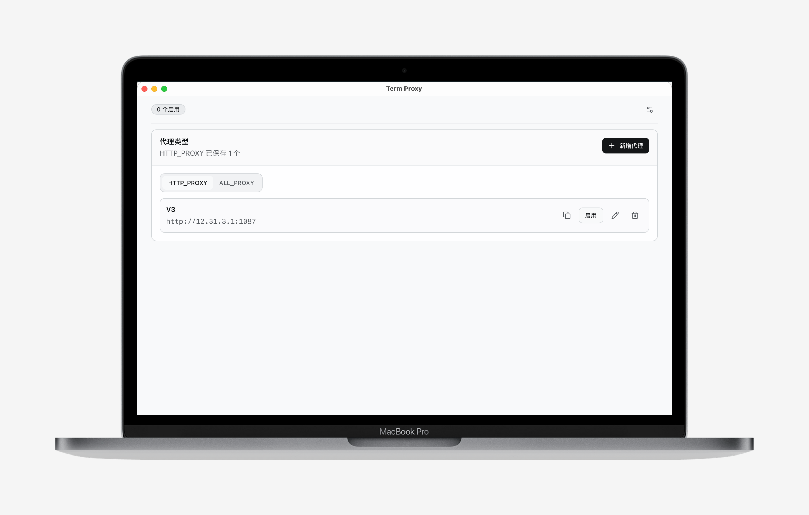

<div align="center">
  

  <h1>Term Proxy</h1>

  <p><strong>ターミナルプロキシを管理する、小さく洗練されたデスクトップアプリ。</strong></p>
  <p>shell profile を手で編集せずに、プロキシを保存、切り替え、無効化できます。</p>

  <p>
    <a href="https://github.com/ruoduan-hub/term-proxy/releases"></a>
    <a href="https://github.com/ruoduan-hub/term-proxy/releases"></a>
    <a href="https://tauri.app/"></a>
    <a href="https://github.com/ruoduan-hub/term-proxy/releases/latest"></a>
    <a href="./LICENSE"></a>
  </p>

  <p>
    <a href="./README.md">English</a> · <a href="./README.zh-CN.md">简体中文</a> · 日本語
  </p>
</div>

Term Proxy は、これまで手動で書いていたような設定:

```bash
export http_proxy=http://127.0.0.1:1087
export https_proxy=http://127.0.0.1:1087
```

を、保存、切り替え、無効化できるコンパクトな UI に置き換えます。アプリ上の
`HTTP_PROXY` は、`http_proxy` と `https_proxy` を同時に書き込む 1 つの設定です。

<p align="center">
  
</p>

## ダウンロード

最新ビルドは [GitHub Releases](https://github.com/ruoduan-hub/term-proxy/releases/latest) からダウンロードできます。

| プラットフォーム | 推奨パッケージ |
| --- | --- |
| macOS | `Term.Proxy_1.0.0_universal.dmg` |
| Windows | `Term.Proxy_1.0.0_x64-setup.exe` または `Term.Proxy_1.0.0_x64_en-US.msi` |
| Linux | `Term.Proxy_1.0.0_amd64.AppImage`、`.deb`、`.rpm` |

macOS ビルドはまだコード署名されていません。初回起動時にブロックされた場合は、Finder のコンテキストメニューから一度開いてください。それでもブロックされる場合は、quarantine 属性を削除します。

```bash
xattr -dr com.apple.quarantine "/Applications/Term Proxy.app"
```

## なぜ作るのか

開発中は、ローカルデバッグ、社内ネットワーク、CLI ツール、一時的なプロキシなどを切り替える場面がよくあります。`.zshrc`、`.bashrc`、PowerShell profile を手で編集する方法は単純ですが、忘れやすく、状態も追いづらくなります。

Term Proxy は、この作業を見える形にします。プロキシを一度登録しておけば、有効な
`HTTP_PROXY` と必要に応じた `ALL_PROXY` を選ぶだけで、新しく開いたターミナルに反映されます。

統合方法は控えめです。Term Proxy は shell profile を乗っ取りません。サポート対象の profile には小さな管理済みローダーブロックだけを追加し、実際のプロキシ値は `~/.term-proxy` 配下の管理ファイルに書き込みます。

## 機能

- `HTTP_PROXY`、`ALL_PROXY`、グローバル `no_proxy` を管理。
- 1 つの `HTTP_PROXY` 設定から `http_proxy` と `https_proxy` を同時に書き込み。
- 種類ごとに複数のプロキシ設定を保存。
- 同じ種類では同時に 1 つだけ有効化し、`HTTP_PROXY` と `ALL_PROXY` は同時に利用可能。
- UI からホストとポートを設定。ユーザー名とパスワードは扱いません。
- グローバル `no_proxy` を設定画面で管理。
- サポート対象 shell の統合を自動で設定。
- 既存 profile のプロキシ値を読み取り、アプリの設定に統合。
- 現在の OS に合ったターミナル用プロキシコマンドをクリップボードへコピー。
- ライト、ダーク、システム連動テーマに対応。
- 英語、簡体字中国語、日本語、繁体字中国語に対応。
- OS 起動時の自動起動に対応。

現在の Term Proxy は、ターミナル環境変数としてのプロキシを管理します。OS のシステムネットワークプロキシ設定は変更しません。

## Shell 統合

Term Proxy は、拡張型のプロキシ統合を採用しています。

macOS と Linux では、アプリが次のファイルを作成します。

```text
~/.term-proxy/proxy.sh
```

そのうえで、`.zshrc` や `.bashrc` などのサポート対象 profile に管理済みローダーブロックを追加します。

Windows PowerShell では、次のファイルを作成します。

```text
~/.term-proxy/proxy.ps1
```

そして PowerShell profile から読み込みます。

profile は引き続きユーザーのものです。Term Proxy が有効化、無効化、更新を行うときに書き換えるのは、アプリが管理するスクリプトファイルだけです。

## 技術スタック

プロジェクト構造は公式の `create-tauri-app` に沿っています。

- Tauri 2 / Rust
- React 19
- TypeScript
- Vite
- Tailwind CSS
- shadcn/ui のコンポーネント規約
- i18next / react-i18next
- Sonner

## 開発

依存関係をインストールします。

```bash
pnpm install
```

Web UI だけを起動します。

```bash
pnpm dev
```

デスクトップアプリを起動します。

```bash
pnpm tauri:dev
```

アプリアイコンを生成します。

```bash
pnpm tauri:icon
```

デスクトップアプリをビルドします。

```bash
pnpm tauri:build
```

## リリースビルド

GitHub Actions は、macOS、Windows、Linux 向けのダウンロード可能なパッケージをビルドします。

メンテナーは、バージョン tag を push して draft GitHub Release を作成できます。

```bash
git tag v1.0.0
git push origin v1.0.0
```

GitHub Actions の `Release` workflow から手動で実行することもできます。生成される Release はデフォルトで draft なので、公開前にアセットを確認できます。

## 品質チェック

フロントエンド:

```bash
pnpm typecheck
pnpm test
pnpm build
```

Rust:

```bash
pnpm cargo:fmt
pnpm cargo:test
```

## 必要環境

- Vite 7 用の Node.js 20.19+ または 22.12+。
- pnpm。
- `rustup` でインストールした Rust stable toolchain。
- 各 OS 向けの Tauri ビルド要件。

Tauri は現在の OS 向けにネイティブアプリをビルドします。macOS、Linux、Windows の成果物は、それぞれ対応する OS または CI runner でビルドしてください。

## FAQ

<details>
<summary><strong>Term Proxy は OS のネットワークプロキシを変更しますか？</strong></summary>

いいえ。Term Proxy はターミナル環境変数としてのプロキシだけを管理します。OS のシステムネットワークプロキシ設定は変更しません。

</details>

<details>
<summary><strong>既に開いているターミナルにすぐ反映されないのはなぜですか？</strong></summary>

環境変数はターミナルセッションの開始時に読み込まれます。Term Proxy で変更した後は、新しいターミナルを開くと最新の設定が使われます。

</details>

<details>
<summary><strong>生成されたプロキシスクリプトはどこに保存されますか？</strong></summary>

Term Proxy は管理スクリプトを `~/.term-proxy` に保存します。shell profile は、管理済みブロックからそれらのスクリプトを読み込むだけです。

</details>

## ライセンス

MIT。詳しくは [`LICENSE`](./LICENSE) を参照してください。
